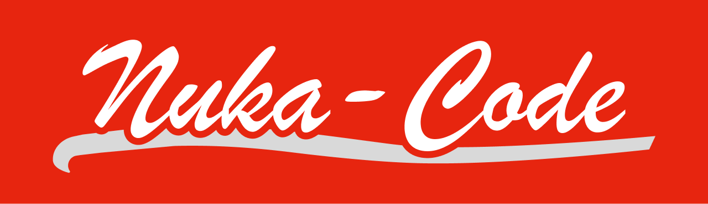

<div align="center">
  
  <blockquote>
    <p>
      "Zap that cache!"
    </p>
  </blockquote>
</div>

# nuka-code

A package brought to you by the Nuka-Cola Corporation to zap away those pesky `cache`, `node_modules`, and other related files & directories.


[](https://github.com/zrosenbauer/nuka-code/actions/workflows/ci.yaml)
[](https://biomejs.dev)

## Usage

```bash
npx nuka-code --help
```

OR

```bash
npm install -g nuka-code
nuka-code --help # or nuke --help
```

## What is this?

Nuka-Code is a CLI tool that removes the need to manually remove `cache`, `node_modules`, and other related files & directories. This can replace the usage of `rimraf` or other similar tools, to clean up your project aka restore
it to a clean state (sort of like the first time you `git clone` your repo).

## What does it do?

This package will nuke (delete aka `rm -rf`) the following:

- cache (`.turbo`, `.vite`, `.next`, etc.)
- node_modules
- build artifacts (`dist`, `out`, `build`, `bundle`, etc.)

You can view a full list of globs [here](./docs/globs.md).

> ![CAUTION]
> By default, Nuka-Code SHOULD NOT nuke anything important like `package-lock.json`, `src/**/*.ts`, `yarn.lock`, but as with all things, use at your own risk.

## Troubleshooting

### Oops I nuked the wrong thing...

Well luckily, Nuka-Code provides a `.nuke/backup-*` directory that will contain a backup of the files that were nuked. Unfortunately, you will need to manually restore the files.

### Its not deleting everything I want it to

Please open an issue with what you want to add to the nuke list and we'll see, we also are considering adding a `nuke.config.ts` file to allow for more customization but for now simplicity is the name of the game.

## Acknowledgements

The name, content, art, and other assets are based on the wonderful Fallout universe, and the Nuka-Cola brand. This is fan-art in the form of an npm package and not intended for commercial use or profit, and is not affiliated with Bethesda Softworks or any of its affiliates.

<!-- Sponsorship footer -->
<br>
<br>
<hr>
<div align="center">
  <h2>Sponsorship</h1>
  <div><sup>Special thanks to:</sup></div>
  <br>
  <br>
  <a href="https://www.joggr.io/?utm_source=github&utm_medium=org-readme&utm_campaign=static-docs">
    
  </a>
</div>
